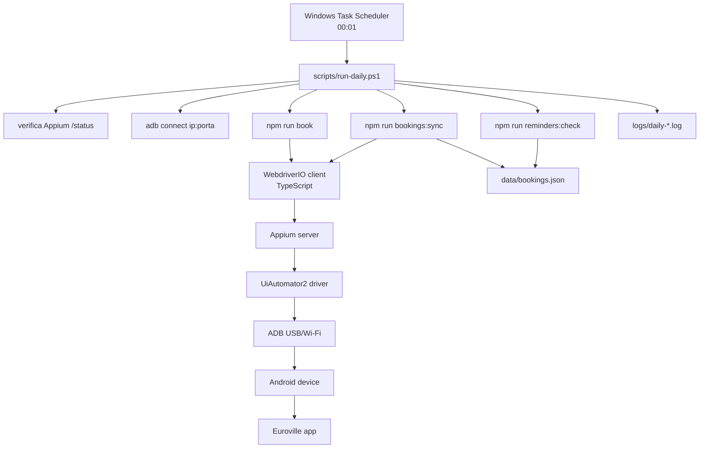
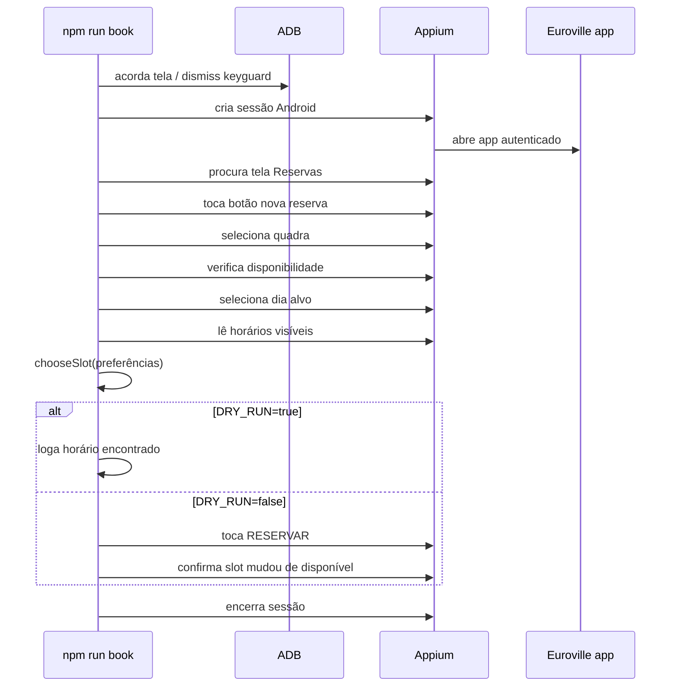

# Arquitetura

Este bot é uma automação local que controla o app Android Euroville como se fosse um usuário tocando na tela.

Analogia web:

- Appium/WebdriverIO = Playwright/Cypress;
- app Android = site/app no browser;
- seletores Android = seletores DOM;
- ADB = ponte de baixo nível entre PC e Android;
- Task Scheduler = cron do Windows.

## Visão geral



## Componentes

### TypeScript

Código da regra de negócio e orquestração.

Arquivos principais:

- `src/book.ts`: abre app, navega, escolhe quadra/horário e reserva;
- `src/syncBookings.ts`: lê tela `Reservas` e salva estado local;
- `src/checkReminders.ts`: verifica lembretes pendentes;
- `src/bookingRules.ts`: regra pura de escolha de horário;
- `src/reminders.ts`: regra pura de lembrete;
- `src/appium/*`: helpers de automação Android;
- `src/adb.ts`: comandos ADB usados antes de abrir Appium;
- `src/config.ts`: `.env` validado.

### Appium

Appium é o servidor que recebe comandos WebDriver e controla Android.

Exemplo mental:

```txt
driver.click(selector)
  -> WebDriver HTTP request
  -> Appium
  -> UiAutomator2
  -> Android Accessibility/UI Automator
  -> toque real no app
```

Ele não usa API privada do Euroville. Ele só enxerga a tela e interage com elementos expostos pelo Android.

### WebdriverIO

WebdriverIO é o client JS/TS que conversa com Appium.

No mundo web, você escreveria:

```ts
await page.getByText('Reservar').click()
```

Aqui, a ideia é parecida:

```ts
await tapByTextOrDescription(driver, 'Verificar disponibilidade')
```

A diferença é que Android usa `text`, `content-desc`, classe, bounds e hierarquia de UI no lugar de DOM/CSS.

### UiAutomator2

UiAutomator2 é o driver Android usado pelo Appium.

Ele permite:

- buscar elementos por texto;
- buscar por `content-desc`;
- clicar;
- voltar;
- ler `pageSource`;
- tirar screenshot.

Limite importante: apps Flutter/React Native/nativos podem expor poucos IDs. Por isso usamos bastante `content-desc` e texto visível.

### ADB

ADB significa Android Debug Bridge. É uma ferramenta oficial do Android SDK para comunicação entre PC e Android.

Usamos ADB para tarefas de baixo nível:

- listar devices;
- conectar via Wi‑Fi;
- acordar tela;
- executar `input keyevent`;
- puxar XML/screenshot;
- manter tela ligada.

## Como funciona ADB Wi‑Fi?

ADB Wi‑Fi não é HTTP comum.

É o mesmo protocolo ADB rodando sobre TCP/IP. No nosso `.env`, `ANDROID_UDID=192.168.0.80:5555` aponta para o daemon ADB do celular naquela rede.

Fluxo:

```txt
PC adb client
  -> adb server local no Windows
  -> conexão TCP até 192.168.0.80:5555
  -> adbd no Android
  -> comandos shell/input/uiautomator
```

Não é REST, não é browser, não é WebSocket de app. É protocolo próprio do ADB.

Consequências:

- PC e celular precisam estar na mesma rede;
- IP pode mudar;
- Android pode desconectar depois de reiniciar/trocar rede;
- primeira autorização exige aceite no celular;
- se o device aparecer `offline`, precisa reconectar/autorizar.

## Como TypeScript integra com Android?

TypeScript não fala direto com Android.

Ele fala com Appium/WebDriver. Appium fala com UiAutomator2. UiAutomator2 usa APIs Android para interagir com a tela.

Camadas:

```txt
TypeScript
  -> WebdriverIO
    -> WebDriver protocol
      -> Appium server
        -> UiAutomator2 driver
          -> Android
```

Qualquer linguagem com client WebDriver/Appium funciona:

- Python;
- Java;
- Kotlin;
- C#;
- Ruby;
- JavaScript/TypeScript.

Escolhemos TS porque:

- testes Vitest ficam simples;
- WebdriverIO é maduro;
- regras puras ficam fáceis de testar;
- evita aprender Android nativo agora.

## Fluxo de reserva



## Seleção de horário

Regra fica separada da automação.

`chooseSlot` recebe horários disponíveis e preferências:

- prioridade de quadras;
- prioridade de horários;
- primeiro match ganha.

Isso mantém regra testável sem celular.

## Sync de reservas

`npm run bookings:sync` lê a tela `Reservas`, parseia o `pageSource` e salva em:

```txt
data/bookings.json
```

Esse arquivo é local e ignorado pelo Git.

Usamos para:

- saber reservas registradas;
- detectar canceladas;
- base para lembrete futuro;
- evitar depender só do resultado imediato do clique.

## Lembretes

`npm run reminders:check` lê `data/bookings.json`.

Hoje ele:

- ignora `CANCELADA`;
- considera `APROVADA`, `RESERVADO`, `CONFIRMADO`;
- detecta reserva começando em até 1h;
- imprime mensagem local;
- não envia WhatsApp ainda.

Próximo passo natural: trocar `console.log` por provider WhatsApp.

## Agendamento no Windows

Windows Task Scheduler funciona como cron.

Criamos tarefa:

```txt
Euroville Booking Bot
  -> diariamente 00:01
  -> powershell.exe -ExecutionPolicy Bypass -File scripts/run-daily.ps1
  -> Start in: C:\Users\Jorge Fernando\Projects\euro-bot
```

O script `scripts/run-daily.ps1` faz a rotina operacional:

1. cria log em `logs/daily-*.log`;
2. lê `.env`;
3. verifica Appium;
4. sobe Appium se necessário;
5. reconecta ADB Wi‑Fi;
6. valida device conectado;
7. executa `npm run book`;
8. executa `npm run bookings:sync`;
9. executa `npm run reminders:check`.

Se algum passo falha, o script aborta com exit code diferente de zero. O Task Scheduler registra isso em `LastTaskResult`.

Valores úteis:

- `LastTaskResult=0`: sucesso;
- `LastTaskResult=1`: falha no script/app/comando;
- `NextRunTime`: próxima execução;
- `LastRunTime`: última tentativa.

## Tela bloqueada

Android/Samsung pode manter lockscreen mesmo com ADB conectado.

O projeto não guarda PIN/senha.

Estratégia atual:

- acorda tela via ADB;
- tenta `wm dismiss-keyguard`;
- faz swipe para sair da tela de bloqueio;
- se Android ainda reportar bloqueado, aborta com erro claro.

Smart Lock/local confiável é a opção prática para este setup.

## Segurança operacional

- `.env` não é versionado;
- `data/`, `logs/`, `outputs/`, `screenshots/` não são versionados;
- `DRY_RUN=true` é padrão seguro;
- reserva real exige `DRY_RUN=false`;
- PIN/senha não entram no repo.

## Próximas extensões

WhatsApp/LLM deve chamar a mesma engine, sem clicar diretamente no app:

```ts
book({ court, date, times, dryRun })
listBookings()
sendReminder(booking)
```

LLM só interpreta intenção e transforma texto livre em JSON validado.
